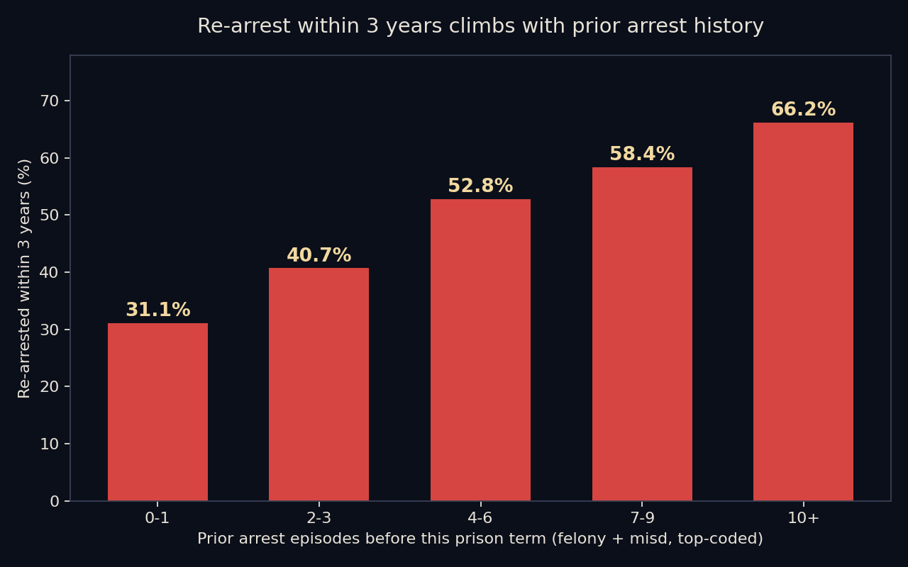
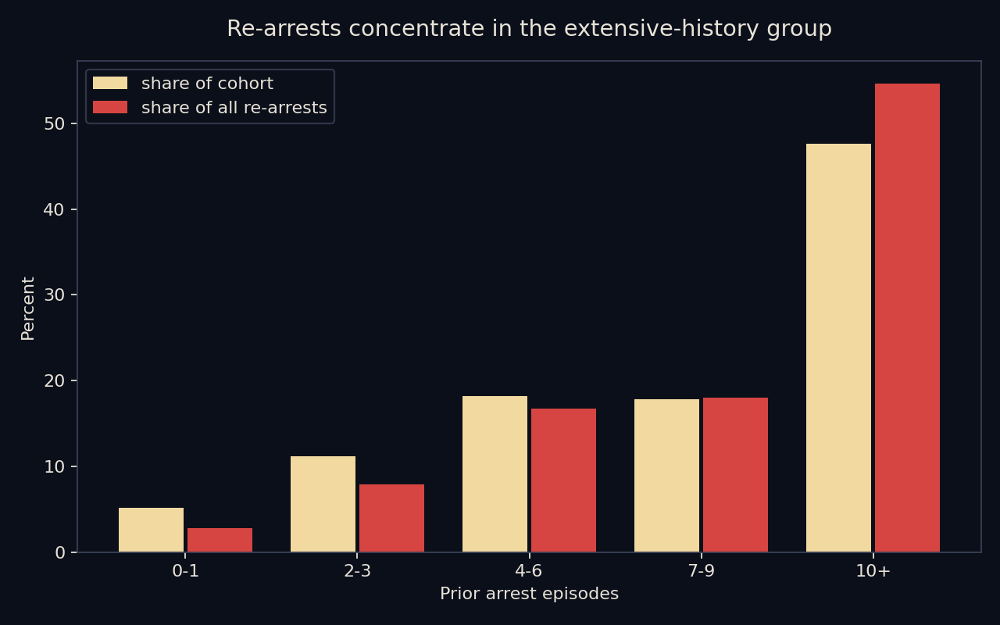

# Recidivism Forecasting — NIJ Challenge Cohort

Predicting 3-year re-arrest for 25,835 Georgia parolees (2013–2015 releases), using the
[NIJ Recidivism Forecasting Challenge](https://nij.ojp.gov/funding/recidivism-forecasting-challenge)
dataset — and, in the 2026 revision, asking the harder question the first pass skipped:
**who is doing the re-offending?**

Original team: **William Brewer, Dale Linn, Kiara Shannon, Hugo Troche** (data analytics bootcamp group project).
Revised findings (2026): William Brewer. Original model and notebooks preserved unchanged.

---

## Revised findings (2026)

The first version of this project treated re-offending as roughly uniform risk spread across
the cohort. Re-reading the data, that's not what it shows. Every figure below is computed by
[`analysis/concentration_analysis.py`](analysis/concentration_analysis.py) from the dataset in `Data/` — run it yourself.

**1. Re-arrest follows prior history in a clean dose-response.**

| Prior arrest episodes* | share of cohort | re-arrested within 3 yrs | share of all re-arrests |
|---|---|---|---|
| 0–1 | 5.2% | **31.1%** | 2.8% |
| 2–3 | 11.2% | **40.7%** | 7.9% |
| 4–6 | 18.2% | **52.8%** | 16.7% |
| 7–9 | 17.8% | **58.4%** | 18.0% |
| 10+ | 47.6% | **66.2%** | 54.6% |

*felony + misdemeanor episodes before this prison term; fields are top-coded, so concentration is **underestimated**.



**2. The cohort's center of gravity is chronic, not incidental.** The *median* parolee here had
**9 prior arrest episodes** before the prison term they were released from. The extensive-history
group (10+) re-offends at two-thirds within three years, and among everyone re-arrested,
**52% are back within the first year**. Gang-affiliated members (15.2% of the cohort) re-arrest
at **79.2%** vs 53.8% otherwise. Repeated prior contact with courts and jail did not interrupt
the trajectory for this group — that is the dominant signal in the data.



**3. This matches five decades of criminal-careers research.** A small, persistent fraction of
offenders accounts for a wildly disproportionate share of offenses: Wolfgang, Figlio & Sellin's
Philadelphia birth cohort (1972) found ~6% of boys produced over half of all police contacts;
Falk et al. (2014), covering the entire Swedish population, found 1% accounted for 63% of violent
crime convictions; Moffitt's (1993) taxonomy distinguishes a small *life-course-persistent* group
from the much larger *adolescence-limited* group whose offending stops on its own. Within-cohort,
our table is the same shape: offending concentrates, and the concentrated group is not deterred
by ordinary cycles of arrest, court, and release.

**What the data does *not* say — kept honest:**
- An **arrest is not a conviction**, and parolees live under heavier surveillance than the public;
  some of the gradient may reflect being watched harder, though the year-1 return speed and the
  size of the gradient make surveillance an implausible sole explanation.
- This is a **parole cohort**, already the deep end of the distribution — these figures describe
  concentration *within* that group, and complement (not duplicate) the population-level studies above.
- Concentration describes **behavior, not destiny**: even in the 10+ band, a third did not re-offend
  within the window. The actionable implication is risk-proportionate supervision and intervention
  (the NIJ challenge's stated purpose), not writing anyone off.

**Bottom line:** the data is most consistent with a **persistent high-frequency offender
subpopulation** driving the bulk of re-offense volume — a pattern traditional arrest-and-release
cycles demonstrably did not change — rather than with re-offense risk being evenly distributed
or primarily incidental.

---

## The model (original project, preserved)

A two-hidden-layer feed-forward network (Adam, binary cross-entropy) over person- and
place-based features, achieving **~77% test accuracy** on `Recidivism_Within_3years`
(see `Processing/` notebooks: Preprocess → Process → Postprocess; earlier exploration in `archive/`).
The pivot-table survey in `Reports/summary.xlsx` ranks single-variable splits;
`Reports/Recidivism.pdf` is the original presentation.

## Repository

```
Data/        NIJ full dataset (25,835 records, 54 fields) — restored in the 2026 revision
Processing/  preprocessing, model training, post-processing notebooks
analysis/    concentration_analysis.py + charts (2026 revision)
Reports/     original deck (PDF), pivot summary (xlsx)
archive/     earlier notebook + prediction runs
```

Reproduce: `pip install pandas matplotlib` then `python analysis/concentration_analysis.py`.

## Sources & acknowledgments

Data: NIJ / Bureau of Justice Statistics, [data.ojp.usdoj.gov (ynf5-u8nk)](https://data.ojp.usdoj.gov/Courts/NIJ-s-Recidivism-Challenge-Full-Dataset/ynf5-u8nk).
Literature: Wolfgang, Figlio & Sellin, *Delinquency in a Birth Cohort* (1972); Moffitt,
*Psychological Review* 100(4) (1993); Falk et al., *Soc Psychiatry Psychiatr Epidemiol* 49 (2014).
Original project guided by Ahmad Mousa and Joshua Steir; built with class materials and AI assistance
(documented honestly, then as now).
